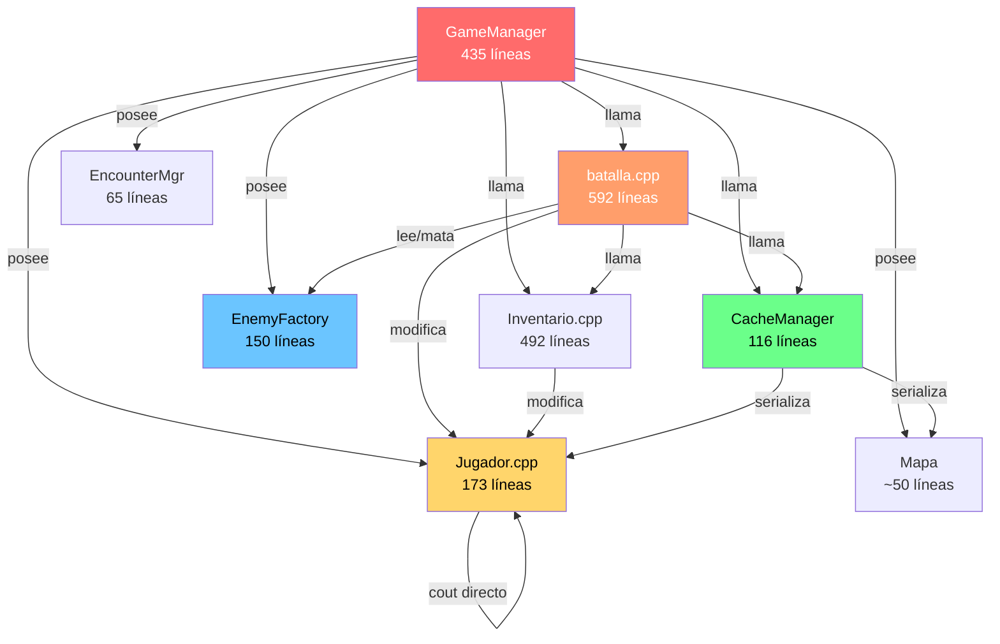

# Auditoría de Sistemas — LeyendaFacyt

> [!NOTE]
> Cada hallazgo tiene **severidad** (qué tan roto está), **riesgo** (qué tan probable es que explote), **prioridad** (cuándo arreglarlo) y **acción concreta** con referencia al código real.

---

## Tabla maestra de hallazgos

| #   | Sistema      | Hallazgo                                                                                                                                                               | Severidad |  Riesgo  | Prioridad | Acción concreta                                                                                                                    |
| --- | ------------ | ---------------------------------------------------------------------------------------------------------------------------------------------------------------------- | :-------: | :------: | :-------: | ---------------------------------------------------------------------------------------------------------------------------------- |
| 1   | GameManager  | God-object: 435 líneas, posee Mapa, Jugador, EnemyFactory, EncounterMgr, objetos. Decide render, input, tiles, combate, guardado, niveles.                             |  🔴 Alta  | 🔴 Alto  |  **P1**   | Extraer `TileHandler`, `LevelLoader`, `OverworldRenderer`. GM solo orquesta estado.                                                |
| 2   | Mapa/Tiles   | `handleTile()` es un if-chain hardcoded (`B`, `K`, `H`). Agregar tile = tocar GameManager + moverJugador + handleTile.                                                 | 🟡 Media  | 🔴 Alto  |  **P1**   | Crear `TileEvent` registry: `map<char, TileHandler>`. Tiles emiten eventos, no ejecutan lógica.                                    |
| 3   | Combate      | `suppressCout()` / `restoreCout()` redirigen `std::cout` para silenciar salida de `atacar()` y `usarMagia()`.                                                          |  🔴 Alta  | 🟡 Medio |  **P1**   | Que `atacar()` y `usarMagia()` retornen struct `ActionResult{dmg, msg}` sin escribir a cout. Eliminar `suppressCout`.              |
| 4   | Combate      | `batalla()` (función libre L519-591): mezcla intro, loot, XP, guardado, y UI post-combate en 73 líneas secuenciales.                                                   | 🟡 Media  | 🟡 Medio |  **P2**   | Mover a `BattleSystem::postBattle()`. Separar `LootResolver`, `XpResolver`. Retornar `BattleResult` al caller.                     |
| 5   | Jugador      | `agregarObjeto()` (L99-113) hace `std::cin >> r` para preguntar si equipar arma — I/O directo en lógica de modelo.                                                     |  🔴 Alta  | 🟡 Medio |  **P1**   | Separar en `agregarObjeto()` (puro) + decisión de equipar en la capa UI.                                                           |
| 6   | Jugador      | `obtenerExperiencia()` (L153-172): level-up con 7 `std::cout` — lógica + presentación mezclados.                                                                       | 🟡 Media  | 🟡 Medio |  **P2**   | Retornar `LevelUpResult` con deltas. Que UI muestre el resultado.                                                                  |
| 7   | Jugador      | `mostrarInventario()` (L68-97): menú texto con `std::cin` — código muerto desde que existe `InventoryUI`.                                                              |  🟢 Baja  | 🟢 Bajo  |  **P3**   | Eliminar `Jugador::mostrarInventario()`. Solo `InventoryUI` maneja esto.                                                           |
| 8   | Inventario   | `InventoryUI` crea su propio `ScreenBuffer` separado del de combate. Al volver, se usa `forceRedraw()` como parche.                                                    | 🟡 Media  | 🟢 Bajo  |  **P3**   | Que `InventoryUI` reciba el `ScreenBuffer&` del contexto padre, no cree uno propio.                                                |
| 9   | Persistencia | Sin versión de formato. Si se agregan/quitan campos del héroe, `cargarHeroe()` con `j["campo"]` crashea.                                                               | 🟡 Media  | 🔴 Alto  |  **P1**   | Agregar `j["version"] = 1`. En carga: switch por versión con migración progresiva. Usar `.value()` para todos los campos.          |
| 10  | Persistencia | `guardarHeroe()` no guarda `saludMaxima` de forma consistente — la guarda, pero `cargarHeroe()` no restaura `saludMaxima` explícitamente (se infiere del constructor). | 🟡 Media  | 🟡 Medio |  **P2**   | Guardar/cargar `saludMaxima` y `manaMaxima` explícitamente. No depender de inferencia del constructor.                             |
| 11  | Persistencia | Guardado automático disperso: se guarda en `handleTile()`, `batalla()`, `guardarPartida()`, `cargarNivel()`.                                                           | 🟡 Media  | 🟡 Medio |  **P2**   | Centralizar en `SaveController` con métodos `autoSave()` y `fullSave()`. Un solo punto de entrada.                                 |
| 12  | Enemigos     | Solo data (stats + arte). Todos atacan igual: `atacar(player)`. Cero variedad de comportamiento.                                                                       | 🟡 Media  | 🟢 Bajo  |  **P4**   | Definir `EnemyBehavior` (strategy pattern): `AggressiveBehavior`, `DefensiveBehavior`, `HealerBehavior`. Seleccionable desde JSON. |
| 13  | Enemigos     | Fórmula de XP confusa: `exp * (nivel * (XP_POR_BATALLA / 5))` — mezcla base del enemigo con constante global.                                                          | 🟡 Media  | 🟡 Medio |  **P3**   | Simplificar: `exp_base * nivel_factor`. Documentar la curva. Mover cálculo a `XpResolver`.                                         |
| 14  | Balance      | `SALUD_POR_NIVEL * (nivel + 1)` y `ATAQUE_POR_NIVEL * (nivel + 1)` — crecimiento cuadrático, rompe balance rápido.                                                     | 🟡 Media  | 🟡 Medio |  **P3**   | Diseñar curva explícita (tabla o fórmula logarítmica). Testear con simulación de 10 niveles.                                       |
| 15  | Balance      | `nivel == 3` hardcoded en `obtenerExperiencia()` L165 como caso especial de XP.                                                                                        |  🟢 Baja  | 🟡 Medio |  **P3**   | Mover curva de XP a `GameBalance.hpp` como tabla: `constexpr int EXP_TABLE[] = {...}`.                                             |
| 16  | Balance      | Encuentros: probabilidad crece +3%/paso hasta 40%. Sin techo dinámico ni ajuste por nivel del jugador.                                                                 | 🟡 Media  | 🟢 Bajo  |  **P4**   | Agregar factor de nivel: menos encuentros si el jugador es muy fuerte para la zona.                                                |
| 17  | Mapa         | `cargarNivel()` hardcodea terreno por switch: `case 1: LLANURA, case 2: MAZMORRA...`                                                                                   | 🟡 Media  | 🟡 Medio |  **P2**   | Mover terreno al `.meta` del mapa o a un JSON de niveles.                                                                          |
| 18  | Mapa         | `renderMapa()` (L171-232) tiene 60 líneas de render + HUD armado a mano con escape codes ANSI.                                                                         | 🟡 Media  | 🟢 Bajo  |  **P3**   | Extraer `OverworldRenderer` que use `ScreenBuffer` (como combate). Consistencia de render.                                         |
| 19  | Combate      | `doPlayerAction()` instancia `InventoryUI invUI(*player)` localmente en cada turno (L366).                                                                             |  🟢 Baja  | 🟢 Bajo  |  **P4**   | Mover como miembro de `BattleSystem`, inicializar una vez.                                                                         |
| 20  | General      | `limpiarBuffer()` y `limpiarPantalla()` son funciones libres en `batalla.cpp` pero se usan en `GameManager`.                                                           |  🟢 Baja  | 🟢 Bajo  |  **P4**   | Mover a `Platform::clearScreen()` y `Platform::clearInputBuffer()`.                                                                |

---

## Mapa de dependencias actual



> [!WARNING]
> **GameManager** y **batalla.cpp** son los dos nodos con más aristas de salida. Todo cambio en Jugador o Mapa se propaga a ambos.

---

## Severidad × Riesgo: Matriz de priorización

```
                    Riesgo Bajo    Riesgo Medio    Riesgo Alto
                  ┌──────────────┬───────────────┬──────────────┐
  Severidad Alta  │              │  #3 #5        │  #1          │
                  ├──────────────┼───────────────┼──────────────┤
  Severidad Media │  #8 #16 #18  │  #4 #6 #10    │  #2 #9       │
                  │              │  #11 #13 #14  │              │
                  ├──────────────┼───────────────┼──────────────┤
  Severidad Baja  │  #7 #19 #20  │  #15          │              │
                  └──────────────┴───────────────┴──────────────┘
```

---

## Plan de ejecución recomendado

### Sprint 1 — Cortar la hemorragia (hallazgos P1)

> [!IMPORTANT]
> Estos 4 cambios eliminan los problemas más peligrosos y desbloquean todo lo demás.

| Hallazgo | Archivo principal | Cambio |
|:--------:|-------------------|--------|
| **#1** | [GameManager.cpp](file:///e:/Documentos/Programas/LeyendaFacyt/src/GameManager.cpp) | Extraer `handleTile` → `TileHandler` autónomo |
| **#2** | [GameManager.cpp](file:///e:/Documentos/Programas/LeyendaFacyt/src/GameManager.cpp#L277-L301) | Tile registry `map<char, function>` en vez de if-chain |
| **#3** | [batalla.cpp](file:///e:/Documentos/Programas/LeyendaFacyt/src/batalla.cpp#L329-L339) + [Jugador.cpp](file:///e:/Documentos/Programas/LeyendaFacyt/src/Jugador.cpp#L16-L51) | Eliminar `suppressCout`. `atacar()` retorna `ActionResult` |
| **#5** | [Jugador.cpp](file:///e:/Documentos/Programas/LeyendaFacyt/src/Jugador.cpp#L99-L113) | Eliminar `cin` de `agregarObjeto()`, mover decisión a UI |
| **#9** | [cacheManager.cpp](file:///e:/Documentos/Programas/LeyendaFacyt/src/cacheManager.cpp#L32-L57) | Agregar `j["version"] = 1`, usar `.value()` en todos los campos |

**Estimación**: ~2 sesiones de trabajo. No requieren cambios de gameplay.

---

### Sprint 2 — Ordenar la casa (hallazgos P2)

| Hallazgo | Archivo principal | Cambio |
|:--------:|-------------------|--------|
| **#4** | [batalla.cpp](file:///e:/Documentos/Programas/LeyendaFacyt/src/batalla.cpp#L519-L591) | `BattleResult` como retorno, `postBattle()` en `BattleSystem` |
| **#6** | [Jugador.cpp](file:///e:/Documentos/Programas/LeyendaFacyt/src/Jugador.cpp#L153-L172) | `LevelUpResult` sin cout |
| **#10** | [cacheManager.cpp](file:///e:/Documentos/Programas/LeyendaFacyt/src/cacheManager.cpp#L59-L111) | Guardar/restaurar saludMaxima y manaMaxima explícitamente |
| **#11** | Varios | `SaveController` centralizado |
| **#17** | [GameManager.cpp](file:///e:/Documentos/Programas/LeyendaFacyt/src/GameManager.cpp#L340-L370) | Terreno → JSON/meta del mapa |

**Estimación**: ~2–3 sesiones. Puede requerir ajustes en headers.

---

### Sprint 3 — Pulir el balance (hallazgos P3)

| Hallazgo | Archivo | Cambio |
|:--------:|---------|--------|
| **#7** | [Jugador.cpp](file:///e:/Documentos/Programas/LeyendaFacyt/src/Jugador.cpp#L68-L97) | Borrar `mostrarInventario()` |
| **#13** | [batalla.cpp](file:///e:/Documentos/Programas/LeyendaFacyt/src/batalla.cpp#L565) | Simplificar fórmula XP |
| **#14** | [Jugador.cpp](file:///e:/Documentos/Programas/LeyendaFacyt/src/Jugador.cpp#L159-L162) | Curva de crecimiento controlada |
| **#15** | [GameBalance.hpp](file:///e:/Documentos/Programas/LeyendaFacyt/lib/GameBalance.hpp) | Tabla de XP por nivel |
| **#18** | [GameManager.cpp](file:///e:/Documentos/Programas/LeyendaFacyt/src/GameManager.cpp#L171-L232) | `OverworldRenderer` con `ScreenBuffer` |

**Estimación**: ~2 sesiones. Incluye testeo de balance.

---

### Sprint 4 — Dar personalidad (hallazgos P4)

| Hallazgo | Archivo | Cambio |
|:--------:|---------|--------|
| **#12** | [EnemyFactory.cpp](file:///e:/Documentos/Programas/LeyendaFacyt/src/EnemyFactory.cpp) | `EnemyBehavior` strategy pattern |
| **#16** | [EncounterManager.cpp](file:///e:/Documentos/Programas/LeyendaFacyt/src/EncounterManager.cpp) | Factor de nivel en probabilidad |
| **#19** | [batalla.cpp](file:///e:/Documentos/Programas/LeyendaFacyt/src/batalla.cpp#L366) | `InventoryUI` como miembro |
| **#20** | [batalla.cpp](file:///e:/Documentos/Programas/LeyendaFacyt/src/batalla.cpp#L16-L24) | Mover a `Platform::` |

**Estimación**: ~2 sesiones. Cambios de gameplay requieren playtesting.

---

## Resumen ejecutivo

| Métrica | Valor |
|---------|-------|
| Total de hallazgos | **20** |
| Prioridad P1 (urgente) | **5** |
| Prioridad P2 (importante) | **5** |
| Prioridad P3 (mejora) | **5** |
| Prioridad P4 (nice-to-have) | **5** |
| Archivos más tocados | `GameManager.cpp`, `batalla.cpp`, `Jugador.cpp` |
| Riesgo más alto | **#1** (god-object) y **#9** (save sin versión) |
| Quick-win más valioso | **#3** (eliminar `suppressCout`) |
| Tiempo estimado total | ~8–10 sesiones de trabajo |

> [!TIP]
> El Sprint 1 es el que más valor aporta por esfuerzo. Si solo haces uno, haz ese. Después de Sprint 1 + Sprint 2, el código será significativamente más mantenible y agregar features será más barato.
